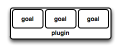

## 1. Core Concepts

现在我们已经成功的第一次运行maven了，那么现在是时候对maven的一些基本概念做出讲解了。

那么让我们回想以下在之前的例子中，我们都干了什么呢：

1. 我们使用Maven的archetype来生成了一个hello world工程
2. 这个工程创建好了之后，其实是由一个POM文件和一些java代码，按照典型的Maven项目目录结构来构成的。
3. 然后我们执行了mvn install，这里把这个动作叫做我们执行了一个lifecycle phase as an argument，这个东西提示
4. Maven去执行一系列的Maven插件的goals，
5. 最终我们的Maven Artifact被安装到了本地仓库local repository

是不是有点晕，什么是lifecycle，什么是goals，什么是local repository？那么本章主要是讲这些的。来自于 [3.5 Core Concepts](https://books.sonatype.com/mvnex-book/reference/simple-project-sect-simple-core.html)

## 1.1 Maven Plugins and Goals

为了执行一个Maven Plugin的Goal，我们可以使用这样的语法：

```cmd
$mvn archetype:generate
...
[INFO] [archetype:generate]
...
```

这里的archetype是一个插件（plugin）的标识符，而这里的generate是一个goal的标识符。

当Maven执行一个插件的Goal的时候，它会把插件的标识符和目标的标识符打印到标准输出中，就像上面这样。

### 1.1.1 What is a Plugin?

一个Maven的插件就是一个或者几个goals的集合。

A maven plugin is a collection of one or many goals.



那么我们来看几个比较简单的但是核心的插件的例子：

1. **Jar plugin**: which contains goals for creating JAR files.
2. **Compiler plugin**: which contains goals for compiling source code and unit tests.
3. **Surefire plugin**: which contains goals for executing unit tests and generating report.

上面说的都是非常常见和通用的plugins，那么当然还有一些非常特殊的plugins，例如：

1. **Hibernate3 plugin**: for integration with the popular persistence library Hibernate.
2. **JRuby plugin**: which allows you to execute Ruby as part of Maven build or to write Maven plugins in Ruby
3. **customer plugins**: Maven also provides for the ability to define custom plugins. A custom plugin can be written in Java.
